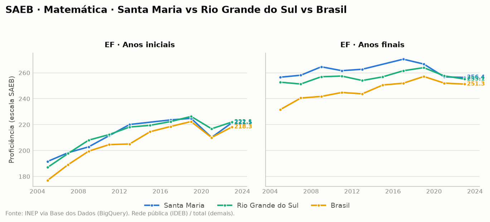
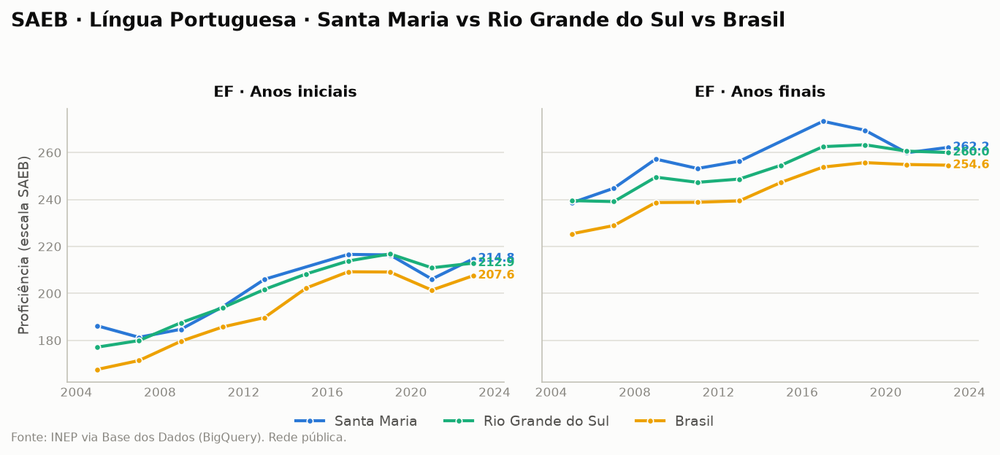
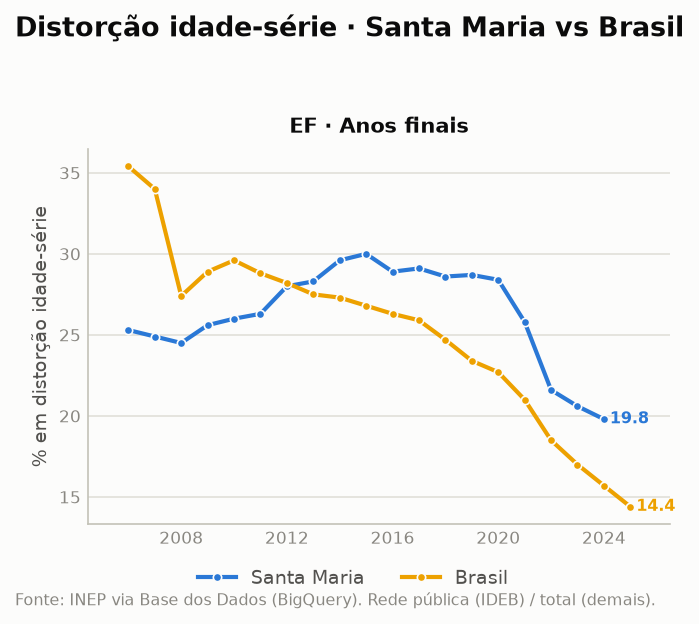
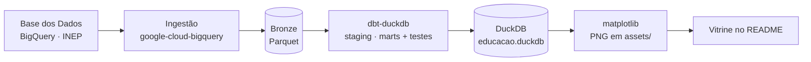

# Observatório da Educação — RS & Santa Maria

> Pipeline de dados de ponta a ponta sobre **educação básica** no Rio Grande do Sul, com
> recorte em **Santa Maria/RS**. Dado público oficial (INEP) → lakehouse → transformação
> testada → gráficos — e a **vitrine vive dentro deste README**, gerada pelo próprio pipeline.


Como Santa Maria se compara ao RS e ao Brasil na educação básica pública — e como isso
evolui no tempo. Não é só um gráfico: é o **pipeline inteiro** (ingestão → bronze →
silver/gold com testes → visualização), reprodutível com um comando.

**Três achados que os dados contam:**
1. 🦠 **A pandemia derrubou a aprendizagem, e o IDEB mascara isso.** Separando o índice em
   proficiência (SAEB) e rendimento (aprovação), a proficiência despencou de 2019 para 2021
   enquanto a aprovação *subia*.
2. ⏳ **Santa Maria vai bem no Fundamental, mas patina no resto.** A distorção idade-série da
   cidade (19,8%) é *pior* que a do Brasil (14,4%) nos anos finais.
3. 📉 **O Ensino Médio é o gargalo.** A aprovação de EM de Santa Maria (78,2%) fica muito abaixo
   do Brasil (94,8%), e o IDEB de EM caiu de 3,1 (2019) para 2,4 (2023).

---

## A vitrine

### IDEB — rede pública, Ensino Fundamental


**IDEB 2023 (rede pública):**

| Etapa | Santa Maria | RS | Brasil |
|---|:-:|:-:|:-:|
| EF · Anos iniciais | **5,8** | 5,8 | 5,7 |
| EF · Anos finais | **4,6** | 4,7 | 4,7 |

Santa Maria acompanha de perto o estado e o país nos anos iniciais (empata com o RS,
acima do Brasil) e fica um décimo abaixo nos anos finais — o gargalo clássico da
transição para o 6º ano, visível nos três níveis.

### SAEB — proficiência (o que compõe o IDEB)

O IDEB combina **proficiência** (nota SAEB) e **rendimento** (aprovação). Separar os dois
revela o que o índice suaviza: **a perda de aprendizagem da pandemia**.




**Proficiência SAEB · Santa Maria, EF anos iniciais (o vale da pandemia):**

| Ano | Matemática | Português |
|---|:-:|:-:|
| 2019 | 224,8 | 216,4 |
| 2021 | 210,2 ⬇️ | 206,1 ⬇️ |
| 2023 | 221,5 ↗️ | 214,8 ↗️ |

A proficiência caiu ~15 pontos de 2019 para 2021 e recuperou quase tudo em 2023 — o mesmo
padrão em RS e Brasil. No **mesmo período a taxa de aprovação subiu**: aprovou-se mais alunos
que aprenderam menos, e o IDEB (que pondera os dois) amortece a queda. Nos **anos finais de
2019**, Santa Maria teve o pico da comparação — Matemática **266,8** e Português **269,5**,
acima de RS e Brasil.

### Taxa de aprovação — Ensino Fundamental e Médio


**Taxa de aprovação, último ano disponível:**

| Etapa | Santa Maria | RS | Brasil |
|---|:-:|:-:|:-:|
| EF · Anos iniciais | 97,5% (2024) | 96,0% (2024) | 98,3% (2025) |
| EF · Anos finais | **97,4% (2024)** | 91,4% (2024) | 96,2% (2025) |
| Ensino médio | **78,2% (2022)** | 85,5% (2024) | 94,8% (2025) |

No Fundamental, Santa Maria lidera os anos finais — salto a partir de ~2019, bem acima da
curva mais baixa do RS. **No Ensino Médio o quadro inverte**: a aprovação de Santa Maria
(78,2%) despenca frente ao Brasil (94,8%), coerente com o IDEB de EM da cidade (2,4). O EM é
o ponto fraco — e, por isso, a etapa onde ainda há mais a ganhar.

### Distorção idade-série — EF anos finais



Recolocada na vitrine **após auditoria** (ver notas de qualidade), restrita à única série que
passa no teste: EF anos finais, Santa Maria vs Brasil. O achado é honesto e não lisonjeiro —
a distorção idade-série de Santa Maria (**19,8% em 2024**) é *mais alta* que a do Brasil
(**14,4%**) e caiu mais tarde. Reforça a leitura dos outros gráficos: a base (anos iniciais)
vai bem, mas o percurso escolar acumula atraso conforme avança.

---

## Arquitetura



| Camada | Ferramenta |
|---|---|
| Ingestão | Python + [`google-cloud-bigquery`](https://cloud.google.com/python/docs/reference/bigquery) (consulta a [Base dos Dados](https://basedosdados.org/)) |
| Lakehouse | [DuckDB](https://duckdb.org/) + Parquet (arquitetura medalhão: bronze → silver → gold) |
| Transformação | [dbt](https://www.getdbt.com/) (`dbt-duckdb`) com testes de schema |
| Visualização | [matplotlib](https://matplotlib.org/) → PNG versionados no repo |

O runner [`run_pipeline.py`](run_pipeline.py) encadeia as três etapas de forma idempotente.

## Recorte e metodologia

- **Níveis geográficos:** Santa Maria (`4316907`) · Rio Grande do Sul · Brasil.
- **Fonte:** INEP (`br_inep_ideb`, `br_inep_indicadores_educacionais`) via Base dos Dados no BigQuery.
- **Indicadores:** IDEB, **notas SAEB** (Matemática/Português — a proficiência que compõe o
  IDEB), **taxa de aprovação** (o rendimento) e **distorção idade-série** (EF anos finais).
- **IDEB / SAEB:** rede **pública** — a única comparável nos três níveis no Ensino Fundamental.
- **Modelo tidy** (`fct_indicadores`): uma linha por `(indicador, nível, etapa, ano, valor)`,
  com testes dbt (`not_null`, `accepted_values`) em todas as chaves — **11/11 verdes**.
- **Regra dos gráficos:** cada etapa é renderizada se tiver **pelo menos 2 séries sólidas**
  (≥5 anos), plotando só as que passam. Por isso o IDEB de EM fica de fora (série curta) mas a
  distorção aparece como Santa Maria vs Brasil.

## ⚠️ Notas de qualidade de dados (transparência)

Decisões tomadas porque **os dados mandam sobre o plano** — e auditadas célula a célula.

- **O bug está na Base dos Dados, não no INEP.** A tabela `br_inep_indicadores_educacionais`
  tem colunas corrompidas de forma sistemática na harmonização: a aprovação de EM do RS, por
  exemplo, aparece como 4–11% em **todas** as fatias de rede/localização (impossível). A fonte
  oficial do INEP é limpa, mas o servidor de download do INEP é inacessível deste ambiente —
  então tratamos a corrupção com **curadoria transparente** (abaixo) em vez de trocar de fonte.
  Detalhe completo em [`docs/MELHORIAS.md`](docs/MELHORIAS.md) (achado AF-6).
- **Distorção idade-série: mantida só onde audita limpo.** A corrupção é irregular — RS quebrado
  até 2022, Santa Maria quebrada nos anos iniciais pós-2020, EM corrompido para todos. A **única
  série que sobrevive é EF anos finais** (Santa Maria e Brasil suaves; RS só confiável ≥2023, e
  por isso omitido do gráfico). A curadoria está documentada em
  [`stg_indicadores.sql`](dbt/models/staging/stg_indicadores.sql).
- **Ensino médio entra só onde o dado aguenta.** O *IDEB* de EM fica fora (Santa Maria reporta
  só 2 anos). A *aprovação* de EM entra como **Santa Maria vs Brasil**: o RS é corrompido na
  origem e cai sozinho pela regra dos gráficos; os pontos corrompidos de SM (2023–24) são
  removidos por um filtro de validade (`valor ∈ [40, 100]`).

## Como rodar

Pré-requisitos: Python 3.12+, uma conta Google Cloud (grátis; 1 TB/mês de consulta no
BigQuery) e projeto com a BigQuery API ativa. Passo a passo detalhado em
[`docs/COMO_RODAR.md`](docs/COMO_RODAR.md).

```bash
python -m venv .venv && source .venv/bin/activate
pip install -r requirements.txt

gcloud auth application-default login          # autentica o ADC (abre o navegador)
cp .env.example .env                           # e preencha BILLING_PROJECT_ID

python run_pipeline.py                         # ingest → dbt build → gráficos
```

Ao final: dados em `data/educacao.duckdb`, gráficos atualizados em `assets/`.

## Estrutura

```
ingestion/extract_bd.py   Base dos Dados (BigQuery) → Parquet bronze (IDEB + SAEB + indicadores)
dbt/models/staging/       stg_ideb, stg_indicadores (limpeza + unpivot + curadoria)
dbt/models/marts/         fct_indicadores (fato tidy + testes)
viz/make_charts.py        DuckDB → PNGs em assets/
run_pipeline.py           orquestra as três etapas
docs/MELHORIAS.md         investigação viva de melhorias e achados
```

---

*Projeto pessoal de portfólio de dados. Fonte: INEP via Base dos Dados. Dados públicos oficiais.*
