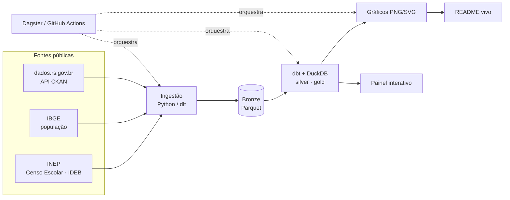

# Observatório da Educação — RS & Santa Maria

> Pipeline de dados de ponta a ponta sobre **educação básica pública** no Rio Grande do Sul,
> com recorte em **Santa Maria/RS**. Ingestão de dado público oficial → modelagem →
> painel — e os gráficos-chave vivem **dentro deste README**, atualizados pelo próprio pipeline.

> ⚠️ **Em construção (Fase 0 — levantamento de fontes).** A vitrine de gráficos entra na Fase 2.

---

## O que é

Um projeto de **engenharia de dados** que responde perguntas sociais concretas sobre a
educação básica — *como a rede pública de Santa Maria se compara ao RS e ao Brasil, e como
isso evolui no tempo*. Fonte: dados abertos oficiais (INEP, IBGE, Governo do RS).

Não é só um dashboard: é o **pipeline inteiro** — ingestão, lakehouse, transformação testada,
orquestração e visualização — construído com o stack open-source atual.

## Perguntas que o projeto responde

- 📈 Como evoluiu o **IDEB** de Santa Maria vs. RS vs. Brasil?
- 🚸 **Fluxo escolar**: aprovação, reprovação e abandono ao longo dos anos
- ⏳ **Distorção idade-série** — quantos alunos estão atrasados
- 🏫 **Infraestrutura** das escolas (água, esgoto, internet, biblioteca, laboratório)
- 👥 **Matrículas** por sexo, cor/raça, zona (urbana/rural) e rede

## Arquitetura

## Stack

| Camada | Ferramenta |
|---|---|
| Ingestão | Python + [`dlt`](https://dlthub.com/) |
| Lakehouse | [DuckDB](https://duckdb.org/) + Parquet (arquitetura medalhão) |
| Transformação | [dbt](https://www.getdbt.com/) (`dbt-duckdb`) + testes |
| Orquestração | [Dagster](https://dagster.io/) / GitHub Actions |
| Visualização | Gráficos no README + painel ([Evidence](https://evidence.dev/) / Streamlit) |

## Fontes de dados

Mapa completo, com links e checagem de acesso, em [`docs/PESQUISA_FONTES.md`](docs/PESQUISA_FONTES.md).

| Fonte | O que dá | Recorte local |
|---|---|---|
| **INEP** (microdados) | Censo Escolar, IDEB, SAEB | filtra Santa Maria (`4316907`) e RS (UF `43`) |
| **dados.rs.gov.br** | matrículas/turmas/docentes agregados (API CKAN, CSV) | estado RS |
| **IBGE** | população, contexto socioeconômico | município/estado |

## Roadmap

- [x] **Fase 0** — levantamento e validação das fontes
- [ ] **Fase 1** — recorte v1 (IDEB + Censo) no medalhão (bronze→silver→gold)
- [ ] **Fase 2** — vitrine de gráficos no README
- [ ] **Fase 3** — painel interativo (deploy)
- [ ] **Fase 4** — README vivo (GitHub Actions agenda a atualização)
- [ ] **Fase 5** — novas fontes e perguntas

---

*Projeto pessoal de portfólio de Leonardo Michelotti. Dados de fontes públicas oficiais.*
