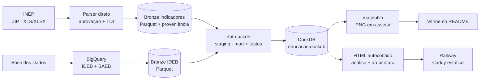

# Observatório da Educação: RS e Santa Maria

> Um produto de dados de ponta a ponta sobre a educação básica em **Santa Maria/RS**.
> Parte de dados públicos do INEP, organiza uma arquitetura medalhão local, aplica
> transformação e testes com dbt e entrega uma narrativa visual publicada na web.


[](https://github.com/leonardo-michelotti/observatorio-educacao-rs/actions/workflows/ci.yml)

**[Abrir a análise](https://observatorio-educacao-rs-production.up.railway.app/)** ·
**[Ver arquitetura e metodologia](https://observatorio-educacao-rs-production.up.railway.app/arquitetura.html)**

O projeto responde como Santa Maria se compara ao Rio Grande do Sul e ao Brasil e como esse
quadro evolui no tempo. O escopo é pequeno de propósito: uma fonte principal, três níveis
geográficos e um contrato de dados simples. O resultado é um pipeline completo, auditável e
fácil de ampliar com novos indicadores e recortes.

### O que este projeto demonstra

- **Engenharia de dados:** ingestão direta das planilhas oficiais do INEP para rendimento e
  distorção, BigQuery apenas para IDEB/SAEB, bronze em Parquet, dbt e DuckDB.
- **Qualidade:** testes de schema, regras explícitas de validade, referências oficiais,
  proveniência por hash e auditoria WCAG automatizada em Chromium.
- **Produto:** gráficos versionados, painel editorial responsivo e explorador com tabela
  alternativa.
- **Operação:** execução centralizada em um runner e deploy estático endurecido no Railway,
  sem credenciais ou dados brutos na imagem. A CI reconstrói o pipeline, testa desktop e
  celular; uma Action separada valida a ingestão real e preserva sua proveniência.
- **Evolução:** o fato tidy permite acrescentar indicadores semelhantes sem redesenhar todo o
  fluxo. Novas granularidades, como escola e rede administrativa, têm um caminho claro para
  dimensões próprias.

**Três achados que os dados contam:**
1. **A aprendizagem caiu no período da pandemia, mas o IDEB amorteceu o movimento.** Separando
   o índice em proficiência (SAEB) e rendimento (aprovação), vê-se que a proficiência caiu de
   2019 para 2021 enquanto a aprovação subiu.
2. **A distância aumenta conforme a etapa avança.** Em 2025, a aprovação de Santa Maria fica
   1,8 ponto percentual abaixo do Brasil nos anos iniciais, 4,9 nos finais e 6,7 no Ensino Médio.
3. **Houve melhora no fluxo, mas o Ensino Médio ainda concentra a maior diferença.** Entre
   2019 e 2025, a TDI do EM da cidade caiu de 27,8% para 20,9%; no último ano, ainda ficou
   acima do RS (18,0%) e do Brasil (16,0%).

---

## A vitrine

### IDEB — rede pública, Ensino Fundamental


**IDEB 2023 (rede pública):**

| Etapa | Santa Maria | RS | Brasil |
|---|:-:|:-:|:-:|
| EF · Anos iniciais | **5,8** | 5,8 | 5,7 |
| EF · Anos finais | **4,6** | 4,7 | 4,7 |

Santa Maria acompanha de perto o estado e o país nos anos iniciais (empata com o RS,
acima do Brasil) e fica um décimo abaixo nos anos finais. A diferença entre as etapas também
aparece no RS e no Brasil, sem que o indicador isolado explique suas causas.

### SAEB — proficiência (o que compõe o IDEB)

O IDEB combina **proficiência padronizada a partir do SAEB** e **rendimento** (aprovação).
Separar os dois revela o que o índice suaviza: **a perda de aprendizagem da pandemia**.


**Proficiência SAEB · Santa Maria, EF anos iniciais (o vale da pandemia):**

| Ano | Matemática | Português |
|---|:-:|:-:|
| 2019 | 224,8 | 216,4 |
| 2021 | 210,2 | 206,1 |
| 2023 | 221,5 | 214,8 |

A proficiência caiu cerca de 15 pontos de 2019 para 2021 e recuperou quase tudo em 2023. O mesmo
padrão aparece no RS e no Brasil. No **mesmo período a taxa de aprovação subiu**: mais alunos
foram aprovados apesar da queda na aprendizagem medida, e o IDEB, que combina os dois
componentes, amorteceu o movimento. Nos **anos finais de 2019**, Santa Maria ficou acima de RS
e Brasil: Matemática **266,8** e Português **269,5**.

### Taxa de aprovação — Ensino Fundamental e Médio


**Taxa de aprovação, comparação no mesmo ano:**

| Etapa | Santa Maria | RS | Brasil |
|---|:-:|:-:|:-:|
| EF · Anos iniciais (2025) | **96,5%** | 96,9% | 98,3% |
| EF · Anos finais (2025) | **91,3%** | 93,9% | 96,2% |
| Ensino médio (2025) | **88,1%** | 91,9% | 94,8% |

Em 2025, Santa Maria fica abaixo de RS e Brasil nas três etapas. A diferença para o país
cresce ao longo do percurso: 1,8 ponto percentual nos anos iniciais, 4,9 nos finais e 6,7 no
Ensino Médio. O resultado é coerente com o IDEB de EM da cidade (2,4 em 2023), mas não apaga
a melhora recente: a aprovação do EM local subiu de 78,6% em 2019 para 88,1% em 2025.

### Distorção idade-série — Ensino Fundamental e Médio


Com a fonte oficial direta, as três etapas e os três níveis voltam à vitrine. Em 2025, Santa
Maria está praticamente alinhada ao Brasil nos anos iniciais (6,7% contra 6,6%). A diferença
abre nos anos finais (18,2% contra 14,4%) e chega a 4,9 pontos no Ensino Médio (20,9% contra
16,0%). Houve melhora: desde 2019, a TDI do EM local caiu 6,9 pontos. Ainda assim, a queda foi
menor que no RS e no Brasil, e a cidade terminou 2025 acima das duas referências.

---

## Arquitetura



| Camada | Ferramenta |
|---|---|
| Ingestão | Python: downloads oficiais do INEP para aprovação/TDI; [Base dos Dados](https://basedosdados.org/) no BigQuery para IDEB/SAEB |
| Lakehouse | [DuckDB](https://duckdb.org/) + Parquet (arquitetura medalhão: bronze → silver → gold) |
| Transformação | [dbt](https://www.getdbt.com/) (`dbt-duckdb`) com testes de schema e testes singulares |
| Publicação | [matplotlib](https://matplotlib.org/) para PNG; HTML autocontido servido por Caddy no Railway |

O runner [`run_pipeline.py`](run_pipeline.py) encadeia ingestão, `dbt build`, geração dos
gráficos e construção das páginas. A bronze separa a captura externa das regras analíticas;
staging padroniza tipos e categorias; o mart `fct_indicadores` entrega um único contrato para
todos os produtos.

> **Painel interativo.** Além dos PNGs da vitrine, o pipeline gera uma peça editorial de dados
> autocontida, com a narrativa "a distância aumenta ao longo do percurso", gráficos anotados, hover, visão de
> tabela e tema claro/escuro. O mesmo gerador cria uma segunda página dedicada à arquitetura,
> metodologia, qualidade e proveniência. Saídas de [`viz/build_dashboard.py`](viz/build_dashboard.py):
> [`viz/dashboard.html`](viz/dashboard.html) (abra localmente, pois o GitHub sanitiza JS) e
> [`viz/arquitetura.html`](viz/arquitetura.html), além de [`public/index.html`](public/index.html)
> e [`public/arquitetura.html`](public/arquitetura.html), prontos para a web.
> O gerador também publica [`public/data-status.json`](public/data-status.json), contrato
> legível por máquina com o último ano disponível de cada indicador e sua rota de origem.
>
> **No ar.** `Dockerfile` + `Caddyfile` (estático, endurecido) + `railway.toml` automatizam o
> deploy no [Railway](https://railway.app/) com HTTPS, sem incluir credenciais ou dados brutos
> na imagem. Passo a passo em [`docs/DEPLOY.md`](docs/DEPLOY.md).

### Decisões e limites da arquitetura

Esta é uma arquitetura local e deliberadamente simples, adequada ao volume e à frequência do
projeto. Parquet preserva as entradas, DuckDB executa a transformação analítica sem servidor e
o Git registra código, SQL, testes, documentação e produtos publicados.

A atualização oficial pode rodar sem uma nova consulta ao BigQuery: o workflow reutiliza o
snapshot auditado de IDEB/SAEB embutido no painel versionado e atualiza aprovação/TDI diretamente
do INEP. Isso mantém o processo reproduzível, mas não elimina a dependência de origem: migrar
IDEB/SAEB para arquivos oficiais diretos continua sendo a evolução prevista.

## Metodologia

- **Pergunta analítica:** como os indicadores agregados de Santa Maria evoluem e como se
  comparam, em cada etapa, com Rio Grande do Sul e Brasil?
- **Recorte geográfico:** Santa Maria (`4316907`) · Rio Grande do Sul · Brasil.
- **Fontes:** planilhas oficiais do INEP para
  [taxa de aprovação](https://www.gov.br/inep/pt-br/acesso-a-informacao/dados-abertos/indicadores-educacionais/taxas-de-rendimento-escolar/)
  e [TDI](https://www.gov.br/inep/pt-br/acesso-a-informacao/dados-abertos/indicadores-educacionais/taxas-de-distorcao-idade-serie);
  IDEB e SAEB via `br_inep_ideb` da Base dos Dados no BigQuery.
- **Períodos disponíveis:** IDEB/SAEB de 2005 a 2023, nas edições da avaliação; aprovação de
  2007 a 2025; TDI de 2006 a 2025.
- **Indicadores e etapas:** IDEB, notas SAEB de Matemática e Língua Portuguesa, aprovação e
  distorção idade-série; anos iniciais, anos finais e Ensino Médio.
- **Rede:** IDEB/SAEB usam a rede **pública**, recorte comum aos três níveis analisados.
- **Modelo tidy** (`fct_indicadores`): uma linha por `(indicador, nível, etapa, ano, valor)`,
  com **10 testes dbt**: oito testes de schema (`not_null`, `accepted_values`) e dois testes
  singulares para unicidade do grão e faixas físicas dos indicadores.
- **Regra de exibição:** uma etapa é renderizada se pelo menos dois níveis têm cinco ou mais
  anos válidos; somente as séries que cumprem esse mínimo são desenhadas.
- **Regra de leitura:** cada etapa é um recorte agregado diferente. Comparar anos iniciais,
  finais e Ensino Médio não equivale a acompanhar a mesma turma ao longo do tempo.
- **Limite de inferência:** as associações do painel são descritivas. Elas não demonstram
  causalidade, desempenho individual nem o efeito isolado de uma política pública.

## Notas de qualidade de dados

O erro identificado estava na camada harmonizada, não nas publicações do INEP. Ele está
registrado na [issue #1430](https://github.com/basedosdados/pipelines/issues/1430), e o
[PR #1653](https://github.com/basedosdados/pipelines/pull/1653) propõe um teste contra novas
regressões. Para não depender da correção externa, este projeto agora baixa as planilhas
oficiais, seleciona semanticamente as colunas e grava URL, hash SHA-256 e tamanho de cada
arquivo em `data/bronze/inep_provenance.json`.

O parser cobre XLS e XLSX, exige uma única coluna semântica por etapa e valida referências
oficiais publicadas para 2025. O dbt verifica campos obrigatórios, categorias aceitas, grão
único e faixas físicas (`0 <= valor <= 100`). Não há interpolação nem correção manual dos
números. IDEB e SAEB continuam temporariamente via BigQuery; removê-lo por completo é a próxima
etapa isolada da migração.

## Como rodar

Pré-requisitos: Python 3.12+ e um projeto Google Cloud com a BigQuery API ativa e faturamento
configurado. O BigQuery oferece franquia mensal de 1 TiB para consultas sob o modelo on-demand;
uso excedente pode gerar cobrança. Consulte os [preços atuais](https://cloud.google.com/bigquery/pricing)
e configure limites de custo. Passo a passo detalhado em
[`docs/COMO_RODAR.md`](docs/COMO_RODAR.md).

Em Bash (Linux, macOS ou WSL):

```bash
python -m venv .venv && source .venv/bin/activate
pip install -r requirements.lock                 # versões reproduzíveis

gcloud auth application-default login          # autentica o ADC (abre o navegador)
cp .env.example .env                           # e preencha BILLING_PROJECT_ID

python run_pipeline.py                         # ingest → dbt build → gráficos → páginas
```

Em PowerShell:

```powershell
python -m venv .venv
.\.venv\Scripts\Activate.ps1
pip install -r requirements.txt

gcloud auth application-default login
Copy-Item .env.example .env                    # preencha BILLING_PROJECT_ID

python run_pipeline.py
```

Ao final: dados em `data/educacao.duckdb`, gráficos em `assets/` e páginas em `public/`.

Para baixar somente os indicadores oficiais, sem Google Cloud:

```bash
python ingestion/extract_inep.py --years 2025       # teste rápido
python ingestion/extract_inep.py                    # histórico completo
```

### Integração contínua sem credenciais

O workflow [`ci.yml`](.github/workflows/ci.yml) roda em cada push e pull request. Ele cria um
bronze sintético determinístico, executa `dbt build`, gera os gráficos e as páginas, roda pytest
e testa navegação e acessibilidade WCAG com Playwright + axe em desktop e celular. Os artefatos
ficam preservados por sete dias. A consulta real ao BigQuery não faz parte da CI.

O workflow manual [`refresh-inep.yml`](.github/workflows/refresh-inep.yml) exercita os downloads
reais, valida as referências oficiais, reconstrói o produto e publica Parquet, proveniência,
logs e páginas como artefatos por 14 dias. Quando as páginas mudam, o bot envia uma branch e
abre um PR; o merge desse PR aciona o deploy normal do Railway.

Esse fluxo não usa a fixture sintética no produto publicado. Para atualizar o site sem consultar
o BigQuery, ele reconstrói `ideb.parquet` a partir do snapshot real de IDEB/SAEB embutido na
última página versionada e substitui somente rendimento e TDI pelo histórico oficial recém
baixado. A fixture continua restrita à CI offline.

## Estrutura

```
ingestion/extract_bd.py   Base dos Dados (BigQuery) → Parquet bronze (IDEB + SAEB)
ingestion/extract_inep.py planilhas oficiais INEP → Parquet (aprovação + TDI + proveniência)
ingestion/load_ideb_snapshot.py  painel versionado → snapshot bronze de IDEB/SAEB
dbt/models/staging/       stg_ideb, stg_indicadores (normalização + unpivot + contratos)
dbt/models/marts/         fct_indicadores (fato tidy + testes)
viz/make_charts.py        DuckDB → PNGs em assets/ (vitrine do README)
viz/build_dashboard.py    DuckDB → páginas autocontidas de análise e arquitetura
run_pipeline.py           orquestra as quatro etapas
tests/                    fixtures e testes de integração offline
.github/workflows/ci.yml  lint, dbt build, geração e testes em push/PR
.github/workflows/refresh-inep.yml  atualização publicável com dados oficiais via PR
.github/workflows/deploy.yml  deploy Railway após a CI verde na main
tests/e2e/                navegação responsiva e acessibilidade WCAG em Chromium
public/data-status.json   último ano disponível e fonte de cada indicador
docs/PESQUISA_FONTES.md   fontes públicas, proveniência e limites de uso
```

---

*Projeto pessoal de portfólio de dados. Fonte: INEP e Base dos Dados. Dados públicos de origem oficial.*
