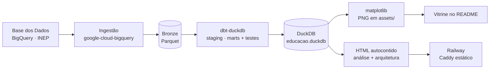

# Observatório da Educação: RS e Santa Maria

> Um produto de dados de ponta a ponta sobre a educação básica em **Santa Maria/RS**.
> Parte de dados públicos do INEP, organiza uma arquitetura medalhão local, aplica
> transformação e testes com dbt e entrega uma narrativa visual publicada na web.


[](https://github.com/leonardo-michelotti/observatorio-educacao-rs/actions/workflows/ci.yml)

**[Abrir a análise](https://observatorio-educacao-rs-production.up.railway.app/)** ·
**[Ver arquitetura e metodologia](https://observatorio-educacao-rs-production.up.railway.app/arquitetura.html)**

O projeto responde como Santa Maria se compara ao Rio Grande do Sul e ao Brasil e como esse
quadro evolui no tempo. O escopo é pequeno de propósito: uma fonte principal, três níveis
geográficos e um contrato de dados simples. O resultado é um pipeline completo, auditável e
fácil de ampliar com novos indicadores e recortes.

### O que este projeto demonstra

- **Engenharia de dados:** ingestão a partir do BigQuery, bronze em Parquet, transformação com dbt e
  consumo analítico no DuckDB.
- **Qualidade:** testes de schema, regras explícitas de validade e curadoria documentada para
  séries problemáticas.
- **Produto:** gráficos versionados, painel editorial responsivo e explorador com tabela
  alternativa.
- **Operação:** execução centralizada em um runner e deploy estático endurecido no Railway,
  sem credenciais ou dados brutos na imagem. A CI reconstrói e testa o pipeline com fixtures
  sintéticas, sem acessar o BigQuery.
- **Evolução:** o fato tidy permite acrescentar indicadores semelhantes sem redesenhar todo o
  fluxo. Novas granularidades, como escola e rede administrativa, têm um caminho claro para
  dimensões próprias.

**Três achados que os dados contam:**
1. **A aprendizagem caiu no período da pandemia, mas o IDEB amorteceu o movimento.** Separando
   o índice em proficiência (SAEB) e rendimento (aprovação), vê-se que a proficiência caiu de
   2019 para 2021 enquanto a aprovação subiu.
2. **Santa Maria vai bem no Fundamental, mas patina no resto.** A distorção idade-série da
   cidade (19,8%) é maior que a do Brasil (15,7%) nos anos finais, comparando 2024.
3. **O Ensino Médio é o gargalo.** A aprovação de EM de Santa Maria (78,2%) fica muito abaixo
   do Brasil (86,6%) em 2022, e o IDEB de EM caiu de 3,1 (2019) para 2,4 (2023).

---

## A vitrine

### IDEB — rede pública, Ensino Fundamental


**IDEB 2023 (rede pública):**

| Etapa | Santa Maria | RS | Brasil |
|---|:-:|:-:|:-:|
| EF · Anos iniciais | **5,8** | 5,8 | 5,7 |
| EF · Anos finais | **4,6** | 4,7 | 4,7 |

Santa Maria acompanha de perto o estado e o país nos anos iniciais (empata com o RS,
acima do Brasil) e fica um décimo abaixo nos anos finais. A diferença entre as etapas também
aparece no RS e no Brasil, sem que o indicador isolado explique suas causas.

### SAEB — proficiência (o que compõe o IDEB)

O IDEB combina **proficiência padronizada a partir do SAEB** e **rendimento** (aprovação).
Separar os dois revela o que o índice suaviza: **a perda de aprendizagem da pandemia**.


**Proficiência SAEB · Santa Maria, EF anos iniciais (o vale da pandemia):**

| Ano | Matemática | Português |
|---|:-:|:-:|
| 2019 | 224,8 | 216,4 |
| 2021 | 210,2 | 206,1 |
| 2023 | 221,5 | 214,8 |

A proficiência caiu cerca de 15 pontos de 2019 para 2021 e recuperou quase tudo em 2023. O mesmo
padrão aparece no RS e no Brasil. No **mesmo período a taxa de aprovação subiu**: mais alunos
foram aprovados apesar da queda na aprendizagem medida, e o IDEB, que combina os dois
componentes, amorteceu o movimento. Nos **anos finais de 2019**, Santa Maria ficou acima de RS
e Brasil: Matemática **266,8** e Português **269,5**.

### Taxa de aprovação — Ensino Fundamental e Médio


**Taxa de aprovação, comparação no mesmo ano:**

| Etapa | Santa Maria | RS | Brasil |
|---|:-:|:-:|:-:|
| EF · Anos iniciais (2024) | **97,5%** | 96,0% | 97,4% |
| EF · Anos finais (2024) | **97,4%** | 91,4% | 94,1% |
| Ensino médio (2022) | **78,2%** | —¹ | 86,6% |

¹ O recorte do RS para 2022 foi excluído pela curadoria por apresentar valor inconsistente.

Em 2024, Santa Maria supera RS e Brasil nas duas etapas do Fundamental. **No Ensino Médio o
quadro inverte**: em 2022, a aprovação de Santa Maria (78,2%) fica abaixo do Brasil (86,6%),
coerente com o IDEB de EM da cidade (2,4 em 2023). O EM é o ponto fraco e, por isso, a etapa
onde ainda há mais a ganhar.

### Distorção idade-série — EF anos finais


Recolocada na vitrine **após auditoria** (ver notas de qualidade), restrita ao único recorte
mantido após a verificação: EF anos finais, Santa Maria vs Brasil. O resultado exige atenção:
a distorção idade-série de Santa Maria (**19,8% em 2024**) é *mais alta* que a do Brasil
(**15,7% em 2024**) e caiu mais tarde. Reforça a leitura dos outros gráficos: a base (anos iniciais)
vai bem, mas o percurso escolar acumula atraso conforme avança.

---

## Arquitetura



| Camada | Ferramenta |
|---|---|
| Ingestão | Python + [`google-cloud-bigquery`](https://cloud.google.com/python/docs/reference/bigquery) (consulta a [Base dos Dados](https://basedosdados.org/)) |
| Lakehouse | [DuckDB](https://duckdb.org/) + Parquet (arquitetura medalhão: bronze → silver → gold) |
| Transformação | [dbt](https://www.getdbt.com/) (`dbt-duckdb`) com testes de schema |
| Visualização | [matplotlib](https://matplotlib.org/) → PNG versionados no repo |

O runner [`run_pipeline.py`](run_pipeline.py) encadeia ingestão, `dbt build`, geração dos
gráficos e construção das páginas.

> **Painel interativo.** Além dos PNGs da vitrine, o pipeline gera uma peça editorial de dados
> autocontida, com a narrativa "começa forte e perde o passo", gráficos anotados, hover, visão de
> tabela e tema claro/escuro. O mesmo gerador cria uma segunda página dedicada à arquitetura,
> metodologia e decisões de curadoria. Saídas de [`viz/build_dashboard.py`](viz/build_dashboard.py):
> [`viz/dashboard.html`](viz/dashboard.html) (abra localmente, pois o GitHub sanitiza JS) e
> [`viz/arquitetura.html`](viz/arquitetura.html), além de [`public/index.html`](public/index.html)
> e [`public/arquitetura.html`](public/arquitetura.html), prontos para a web.
>
> **No ar.** `Dockerfile` + `Caddyfile` (estático, endurecido) + `railway.toml` automatizam o
> deploy no [Railway](https://railway.app/) com HTTPS, sem incluir credenciais ou dados brutos
> na imagem. Passo a passo em [`docs/DEPLOY.md`](docs/DEPLOY.md).

### Escopo atual e caminho de evolução

Esta é uma arquitetura deliberadamente simples, adequada ao volume e à frequência atuais. Ela
está fechada como produto de portfólio: dados, transformação, testes, documentação, visualização
e deploy fazem parte do mesmo fluxo.

Para crescer dentro do recorte atual, um novo indicador passa por ingestão, staging, mart,
testes e registro na visualização. Se o projeto avançar para escolas, múltiplas redes, mais
fontes ou atualizações frequentes, a evolução natural inclui dimensões explícitas, ingestão
atômica, testes de contrato mais amplos e proveniência de cada extração.

## Recorte e metodologia

- **Níveis geográficos:** Santa Maria (`4316907`) · Rio Grande do Sul · Brasil.
- **Fonte:** INEP (`br_inep_ideb`, `br_inep_indicadores_educacionais`) via Base dos Dados no BigQuery.
- **Indicadores:** IDEB, **notas SAEB** (Matemática/Português, a proficiência que compõe o
  IDEB), **taxa de aprovação** (o rendimento) e **distorção idade-série** (EF anos finais).
- **IDEB / SAEB:** rede **pública**, a única comparável nos três níveis no Ensino Fundamental.
- **Modelo tidy** (`fct_indicadores`): uma linha por `(indicador, nível, etapa, ano, valor)`,
  com **10 testes dbt**: oito testes de schema (`not_null`, `accepted_values`) e dois testes
  singulares para unicidade do grão e faixas físicas dos indicadores.
- **Regra dos gráficos:** cada etapa é renderizada se tiver **pelo menos 2 séries sólidas**
  (≥5 anos), plotando só as que passam. Por isso o IDEB de EM fica de fora (série curta) mas a
  distorção aparece como Santa Maria vs Brasil.

## Notas de qualidade de dados

As decisões abaixo foram tomadas após auditoria célula a célula.

- **O bug está na camada harmonizada, não na publicação oficial do INEP.** A tabela
  `br_inep_indicadores_educacionais`
  tem colunas corrompidas de forma sistemática na harmonização: a aprovação de EM do RS, por
  exemplo, aparece entre 4% e 11% em **todas** as fatias de rede/localização, um intervalo
  incompatível com as planilhas oficiais. O problema está registrado na
  [issue #1430](https://github.com/basedosdados/pipelines/issues/1430), e o
  [PR #1653](https://github.com/basedosdados/pipelines/pull/1653) propõe um teste contra novas
  regressões. A integração direta dos arquivos do INEP é um próximo passo; por enquanto,
  mantemos a Base dos Dados com curadoria explícita.
  A metodologia e as decisões de curadoria estão na
  [página de arquitetura](https://observatorio-educacao-rs-production.up.railway.app/arquitetura.html)
  e nos modelos dbt versionados.
- **Distorção idade-série: mantida só onde audita limpo.** A corrupção é irregular: RS quebrado
  até 2022, Santa Maria quebrada nos anos iniciais pós-2020, EM corrompido para todos. A **única
  série que sobrevive é EF anos finais** (Santa Maria e Brasil suaves; RS só confiável ≥2023, e
  por isso omitido do gráfico). A curadoria está documentada em
  [`stg_indicadores.sql`](dbt/models/staging/stg_indicadores.sql).
- **Ensino médio entra só onde o dado aguenta.** O *IDEB* de EM fica fora (Santa Maria reporta
  só 2 anos). A *aprovação* de EM entra como **Santa Maria vs Brasil**: o RS é corrompido na
  origem e cai sozinho pela regra dos gráficos; os pontos corrompidos de SM (2023–24) são
  removidos por uma heurística de curadoria específica deste projeto (`valor ∈ [40, 100]`).
  O intervalo reduz anomalias conhecidas, mas não substitui a validação contra a fonte oficial.

## Como rodar

Pré-requisitos: Python 3.12+ e um projeto Google Cloud com a BigQuery API ativa e faturamento
configurado. O BigQuery oferece franquia mensal de 1 TiB para consultas sob o modelo on-demand;
uso excedente pode gerar cobrança. Consulte os [preços atuais](https://cloud.google.com/bigquery/pricing)
e configure limites de custo. Passo a passo detalhado em
[`docs/COMO_RODAR.md`](docs/COMO_RODAR.md).

Em Bash (Linux, macOS ou WSL):

```bash
python -m venv .venv && source .venv/bin/activate
pip install -r requirements.txt

gcloud auth application-default login          # autentica o ADC (abre o navegador)
cp .env.example .env                           # e preencha BILLING_PROJECT_ID

python run_pipeline.py                         # ingest → dbt build → gráficos → páginas
```

Em PowerShell:

```powershell
python -m venv .venv
.\.venv\Scripts\Activate.ps1
pip install -r requirements.txt

gcloud auth application-default login
Copy-Item .env.example .env                    # preencha BILLING_PROJECT_ID

python run_pipeline.py
```

Ao final: dados em `data/educacao.duckdb`, gráficos em `assets/` e páginas em `public/`.

### Integração contínua sem credenciais

O workflow [`ci.yml`](.github/workflows/ci.yml) roda em cada push e pull request. Ele cria um
bronze sintético determinístico, executa `dbt build`, gera os gráficos e as páginas, roda testes
de integração com pytest e preserva os artefatos por sete dias. A consulta real ao BigQuery não
faz parte da CI e continua protegida por credenciais locais.

## Estrutura

```
ingestion/extract_bd.py   Base dos Dados (BigQuery) → Parquet bronze (IDEB + SAEB + indicadores)
dbt/models/staging/       stg_ideb, stg_indicadores (limpeza + unpivot + curadoria)
dbt/models/marts/         fct_indicadores (fato tidy + testes)
viz/make_charts.py        DuckDB → PNGs em assets/ (vitrine do README)
viz/build_dashboard.py    DuckDB → páginas autocontidas de análise e arquitetura
run_pipeline.py           orquestra as quatro etapas
tests/                    fixtures e testes de integração offline
.github/workflows/ci.yml  lint, dbt build, geração e testes em push/PR
docs/PESQUISA_FONTES.md   fontes públicas, proveniência e limites de uso
```

---

*Projeto pessoal de portfólio de dados. Fonte: INEP via Base dos Dados. Dados públicos de origem oficial.*
