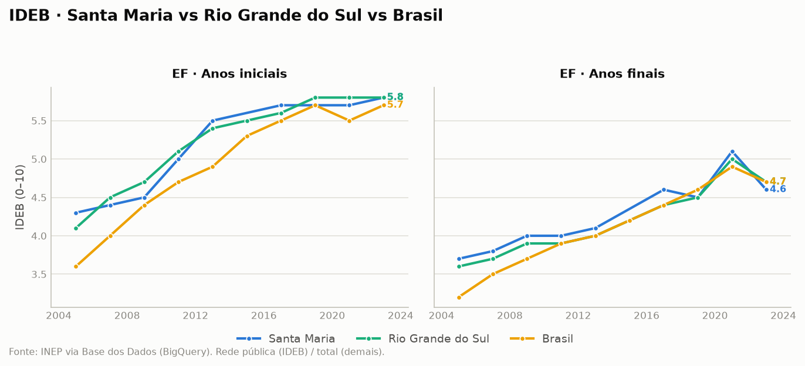
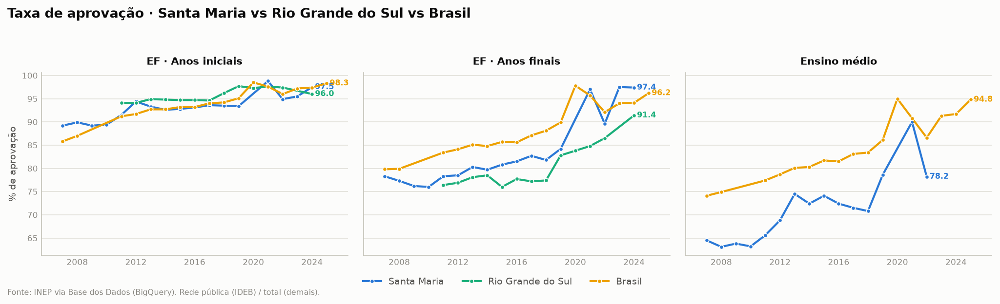
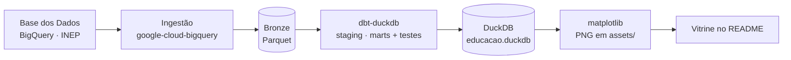

# Observatório da Educação — RS & Santa Maria

> Pipeline de dados de ponta a ponta sobre **educação básica** no Rio Grande do Sul, com
> recorte em **Santa Maria/RS**. Dado público oficial (INEP) → lakehouse → transformação
> testada → gráficos — e a **vitrine vive dentro deste README**, gerada pelo próprio pipeline.


Como Santa Maria se compara ao RS e ao Brasil na educação básica pública — e como isso
evolui no tempo. Não é só um gráfico: é o **pipeline inteiro** (ingestão → bronze →
silver/gold com testes → visualização), reprodutível com um comando.

---

## A vitrine

### IDEB — rede pública, Ensino Fundamental



**IDEB 2023 (rede pública):**

| Etapa | Santa Maria | RS | Brasil |
|---|:-:|:-:|:-:|
| EF · Anos iniciais | **5,8** | 5,8 | 5,7 |
| EF · Anos finais | **4,6** | 4,7 | 4,7 |

Santa Maria acompanha de perto o estado e o país nos anos iniciais (empata com o RS,
acima do Brasil) e fica um décimo abaixo nos anos finais — o gargalo clássico da
transição para o 6º ano, visível nos três níveis.

### Taxa de aprovação — Ensino Fundamental



**Taxa de aprovação, último ano disponível:**

| Etapa | Santa Maria | RS | Brasil |
|---|:-:|:-:|:-:|
| EF · Anos iniciais | 97,5% (2024) | 96,0% (2024) | 98,3% (2025) |
| EF · Anos finais | **97,4% (2024)** | 91,4% (2024) | 96,2% (2025) |

Nos anos finais, Santa Maria salta a partir de ~2019 e passa a liderar a comparação —
contraste forte com a curva mais baixa do RS na mesma etapa.

---

## Arquitetura



| Camada | Ferramenta |
|---|---|
| Ingestão | Python + [`google-cloud-bigquery`](https://cloud.google.com/python/docs/reference/bigquery) (consulta a [Base dos Dados](https://basedosdados.org/)) |
| Lakehouse | [DuckDB](https://duckdb.org/) + Parquet (arquitetura medalhão: bronze → silver → gold) |
| Transformação | [dbt](https://www.getdbt.com/) (`dbt-duckdb`) com testes de schema |
| Visualização | [matplotlib](https://matplotlib.org/) → PNG versionados no repo |

O runner [`run_pipeline.py`](run_pipeline.py) encadeia as três etapas de forma idempotente.

## Recorte e metodologia

- **Níveis geográficos:** Santa Maria (`4316907`) · Rio Grande do Sul · Brasil.
- **Fonte:** INEP (`br_inep_ideb`, `br_inep_indicadores_educacionais`) via Base dos Dados no BigQuery.
- **IDEB:** rede **pública** — única comparável nos três níveis no Ensino Fundamental.
- **Taxa de aprovação:** rede/localização **total**, com filtro de validade (valor em `[40, 100]`)
  que descarta pontos corrompidos isolados da fonte.
- **Modelo tidy** (`fct_indicadores`): uma linha por `(indicador, nível, etapa, ano, valor)`,
  com testes dbt (`not_null`, `accepted_values`) em todas as chaves.

## ⚠️ Notas de qualidade de dados (transparência)

Decisões tomadas porque **os dados mandam sobre o plano**:

- **Distorção idade-série foi retirada da vitrine.** Na fonte, a série do RS é irreal
  (~1,5% na década toda vs. ~15% do Brasil) e os anos 2023–2024 estão corrompidos para RS e
  Santa Maria. Sem comparação honesta possível, o indicador saiu (as colunas `tdi_*` ainda são
  extraídas ao bronze como referência bruta — ver [`stg_indicadores.sql`](dbt/models/staging/stg_indicadores.sql)).
- **Ensino médio não entra nos gráficos.** É competência estadual: Santa Maria mal reporta
  IDEB de EM (2 anos) e a série de aprovação/EM do RS é esburacada/corrompida na origem. Os
  gráficos só renderizam etapas com série mínima nos três níveis (Ensino Fundamental).

## Como rodar

Pré-requisitos: Python 3.12+, uma conta Google Cloud (grátis; 1 TB/mês de consulta no
BigQuery) e projeto com a BigQuery API ativa. Passo a passo detalhado em
[`docs/COMO_RODAR.md`](docs/COMO_RODAR.md).

```bash
python -m venv .venv && source .venv/bin/activate
pip install -r requirements.txt

gcloud auth application-default login          # autentica o ADC (abre o navegador)
cp .env.example .env                           # e preencha BILLING_PROJECT_ID

python run_pipeline.py                         # ingest → dbt build → gráficos
```

Ao final: dados em `data/educacao.duckdb`, gráficos atualizados em `assets/`.

## Estrutura

```
ingestion/extract_bd.py   Base dos Dados (BigQuery) → Parquet bronze
dbt/models/staging/       stg_ideb, stg_indicadores (limpeza + unpivot)
dbt/models/marts/         fct_indicadores (fato tidy + testes)
viz/make_charts.py        DuckDB → PNGs em assets/
run_pipeline.py           orquestra as três etapas
```

---

*Projeto pessoal de portfólio de dados. Fonte: INEP via Base dos Dados. Dados públicos oficiais.*
